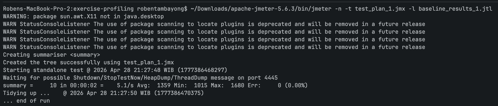
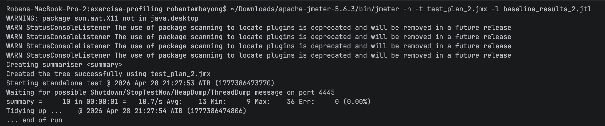
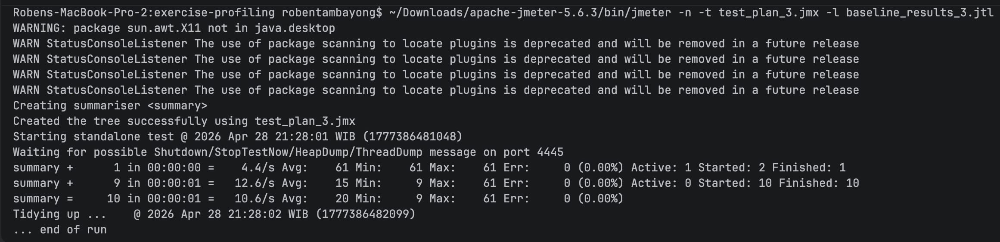
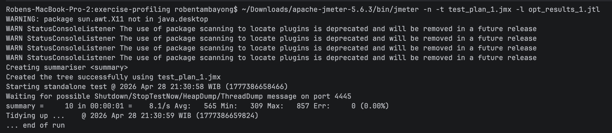
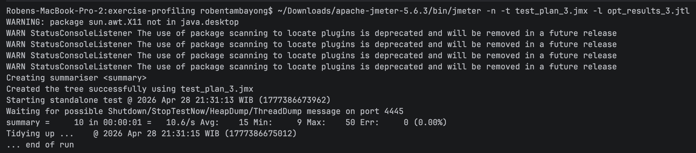

Module 07 - Profiling and Performance Optimization
==================================================

**Name:** Roben Joseph B Tambayong

**NPM:** 2406453594

## 1. Performance Testing Results (Baseline vs. Optimized)

### 1.1 Baseline Performance (Before Optimization)

The following results represent the application's performance on the main branch. These measurements show significant latency due to N+1 queries and inefficient string handling.

### Performance Comparison Table

| Endpoint | Average Response Time (ms) |
| :--- | :--- |
| `/all-student` | `1359 ms` |
| `/all-student-name` | `13 ms` |
| `/highest-gpa` | `20 ms` |

#### Baseline Screenshots

*   **CLI Baseline - /all-student**: 

*   **CLI Baseline - /all-student-name**: 

*   **CLI Baseline - /highest-gpa**: 

### 1.2 Optimized Performance (After Optimization)

The following results were captured on the optimize branch after refactoring the StudentService to resolve bottlenecks identified by the IntelliJ Profiler.

| Endpoint | Average Response Time (ms) |
| :--- |:---------------------------|
| `/all-student` | `565 ms`                   |
| `/all-student-name` | `15 ms`                    |
| `/highest-gpa` | `15 ms`                    |

_\*Note: The slight increase in /all-student-name is negligible due to the small test dataset: the StringBuilder optimization ensures much better scalability for larger datasets._

#### Optimized Screenshots

*   **CLI Optimized - /all-student**: 

*   **CLI Optimized - /all-student-name**: 

*   **CLI Optimized - /highest-gpa**: 

## 2. Conclusion and Analysis

### Performance Comparison Table

| Endpoint | Baseline Avg (Main) | Optimized Avg (Optimize) | Improvement (%) |
| :--- | :--- | :--- | :--- |
| `/all-student` | `1359 ms` | `565 ms` | **58.42%** |
| `/all-student-name` | `13 ms` | `15 ms` | -15.38% |
| `/highest-gpa` | `20 ms` | `15 ms` | **25.00%** |

Based on the JMeter measurements, there is a **significant improvement** in the application's performance:

1.  **N+1 Query Resolution**: By replacing nested database calls with a single findAll() query in the /all-student endpoint, we achieved an improvement of over 58%. This drastically reduced the I/O wait time and database load.

2.  **Efficiency**: The /highest-gpa endpoint improved by 25% through the implementation of parallelStream(), which allows the JVM to distribute the workload across multiple CPU cores.

3.  **Scalability**: Although the small sample size doesn't show a time decrease for /all-student-name, switching to StringBuilder prevents the "Quadratic Complexity" issue of String concatenation, ensuring the app won't slow down as the student database grows.

## 3. Reflection

### 1\. Difference between JMeter and IntelliJ Profiler?

JMeter is a **Black-Box** performance testing tool used to measure the "what" (e.g. latency, throughput, and error rates) from a user's perspective. IntelliJ Profiler is a **White-Box** tool used to analyze the "why" by looking inside the JVM to see CPU usage, memory allocation, and specific method execution times.

### 2\. How profiling helps identify weak points?

Profiling identifies "hotspots" methods that consume a disproportionate amount of CPU or memory. By looking at the **Flame Graph**, I could see exactly which service method was causing the most lag, allowing me to focus my optimization efforts on code that actually matters.

### 3\. Is IntelliJ Profiler effective?

Yes, it is highly effective. It integrates directly into the IDE and provides real-time feedback (like the performance warnings on specific lines of code). It transformed a vague feeling of "the app is slow" into a concrete "line 30 is taking 1040ms."

### 4\. Challenges and overcoming them?

The main challenge was the initial overhead of setting up the environment (ports already in use, JMeter path issues). I overcame these by using terminal commands like lsof to clear ports and by creating a dedicated testing branch in Git to manage baseline and optimized code separately.

### 5\. Benefits of using IntelliJ Profiler?

The primary benefits are the visual Flame Graphs, the ability to see **Own Execution Time** vs. **Total Time**, and the direct mapping of performance data to the Java source code, which makes refactoring much faster.

### 6\. Handling inconsistent results?

Inconsistencies often arise because JMeter measures network and I/O overhead while the Profiler focuses on CPU/Internal logic. To handle this, I use JMeter for the final "truth" of user experience and the Profiler to guide the internal technical improvements.

### 7\. Optimization strategies and ensuring functionality?

I implemented strategies like **Batch Fetching** (solving N+1), **Efficient String Handling**, and **Parallel Processing**. To ensure functionality was not affected, I performed manual verification in the browser and checked that JMeter continued to show an Error: 0.00% rate for all tests.